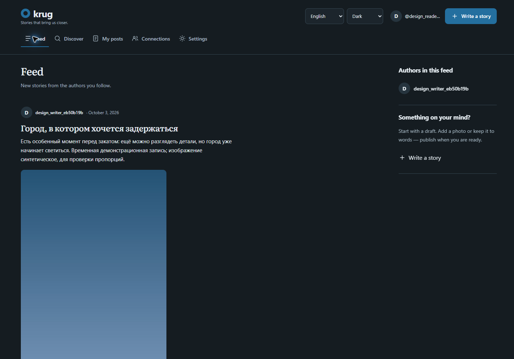
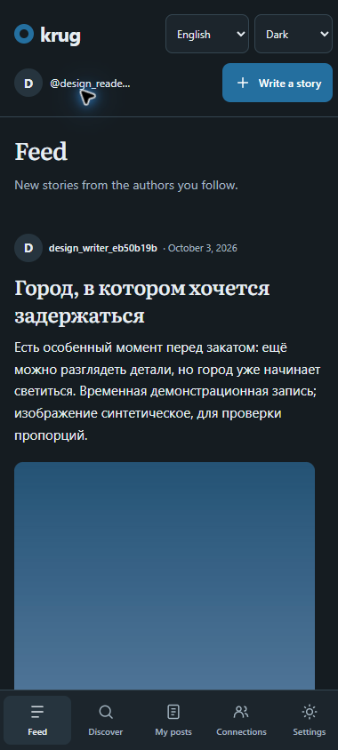

<div align="center">

# Krug

**People, projects, possibilities.**

A web-first collaboration network to discover opted-in people, native projects,
externally sourced projects and open roles, with project updates and applications.


[](LICENSE)


**English** · [Русский](README.ru.md) · **Work in progress**

</div>

---

[Overview](#overview) · [Quick start](#quick-start-on-a-linux-execution-host) ·
[Accounts](#accounts-and-development-mail) · [Search](#full-text-search) ·
[Tests](#tests) · [Limitations](#scope-and-license)

## Overview

Discover people, native and external projects, and open roles without an account.
Create projects, apply to roles and share public text/photo updates. GitHub metadata
refreshes automatically through the existing worker. Profiles are discoverable only
by consent; private contact links are shared with a project owner and accepted
applicants. Russian/English and light/dark/system themes remain available. Standalone
stories and author feeds are preserved under Stories. See [import policy](docs/discovery.md).

| Area | Included |
| --- | --- |
| Projects | Native/external project discovery, public pages, OpenGraph and project updates |
| Collaboration | Opt-in people profiles, openings, applications, owner decisions and accepted-member updates |
| Privacy | Saves/follows stay private; interest is visible only through explicit per-project consent; contacts are shared only after acceptance |
| Writing | Private drafts, optional titles, editing, publication and one photo per post |
| Reading | Public discovery, full-text search and a feed of followed authors |
| People | Public profiles, biographies, follows, likes and flat comments |
| Accounts | Email verification, password recovery and account-wide sign-out |
| Email | Explicit opt-in publication updates; verification and reset links |
| Interface | Russian/English, light/dark/system themes, desktop and mobile layouts |

### Stack

| Layer | Technology |
| --- | --- |
| API | Python 3.14, FastAPI, Pydantic |
| Data | PostgreSQL 15, SQLAlchemy, Alembic, native full-text search |
| Background work | Celery, Redis, SMTP; Mailpit for captured development mail |
| Interface | Native HTML, CSS and JavaScript; no frontend build step |
| Execution | Docker Compose or Podman on Linux |

The API lives in `backend/`, the interface in `frontend/`. Both are served by the
same web service at `/app`. Access/refresh tokens use per-tab sessionStorage;
logout revokes all sessions. Use HTTPS for public hosting.

Project references: [product scope](PRODUCT.md) · [design system](DESIGN.md) ·
[API guide](docs/api.md) · [development and deployment](docs/development.md) ·
[GitHub Checks](https://github.com/wsersigma228/krug/actions/workflows/check.yml).
This is a working project in development, with no production uptime or scale claim.

<details>
<summary>Earlier preview: desktop and mobile</summary>

Screenshots use fictional demo content and predate the current visual refinement.
The current layout and tokens are documented in [DESIGN.md](DESIGN.md).





</details>

## Interface language and appearance

The interface supports Russian and English. On first visit, it uses the first
supported language in the browser's preference order, with English fallback. Manual
language selection is stored in this browser. For signed-in users, the account's
saved language takes precedence and is shared across devices; an account without
a choice saves the current interface language when the UI first loads it.
Posts, comments, biographies and usernames are never translated. Search language
is an independent PostgreSQL matching mode, not the interface language.

Light, dark and system themes are available. The default uses cold graphite and a
restrained blue accent; existing saved choices are respected. Collaboration
discovery uses distinct person, project and role cards in a fluid wide shell. Stories
retain a responsive masonry feed with native sans-serif text and distinct author,
title and date hierarchy. Story layouts use a centered shell capped at 3600 CSS px.
Each story card shows its author, optional proportional photo, optional title and
text; there is no contextual author column. Mobile uses a single column.
The sticky header compacts while scrolling
down and expands while scrolling up, keeping navigation and preferences reachable;
reduced-motion settings disable transitions. System follows the operating system's
color preference. Theme selection is stored per browser and does not sync through
the account. Preferences use localStorage; authentication uses per-tab sessionStorage.
Like and unlike directly in the feed; the labelled Comments action opens the
discussion inside the full post. RU/EN switches language; the theme icon opens
Light, Dark and System choices. The frontend has no build step or third-party runtime.
Tablet account and compose actions use compact icons with accessible names.
Search keeps its labels available to assistive technology while visually hiding them.

## Quick start on a Linux execution host

Clone this repository; Python 3.14 and Docker Compose or Podman are required.
Containers run on your chosen Linux execution host.

```bash
git clone https://github.com/wsersigma228/krug.git
cd krug
python3.14 -m venv .venv
.venv/bin/python -m pip install -r requirements-dev.txt -c constraints.txt
cp .env.example .env
```

Set a unique `SECRET_KEY` and strong `DB_PASSWORD` in `.env`. Generate secrets with
`.venv/bin/python -c 'import secrets; print(secrets.token_urlsafe(48))'`.
Keep `DB_USER`, `DB_PASSWORD`, `DB_NAME` and the host `DATABASE_URL` consistent;
use a hexadecimal database password to avoid URL-reserved punctuation (generate
one with `.venv/bin/python -c 'import secrets; print(secrets.token_hex(32))'`).
A fresh database volume uses
these credentials; changing `.env` does not change users/passwords in an existing database.

```bash
./scripts/start --dev-mail
```

UI: http://localhost:8000/app. Swagger: http://localhost:8000/docs.
Mailpit: http://localhost:8025. For configured external SMTP, use `./scripts/start`
without `--dev-mail`. The launcher builds the app, stops app services, starts
and waits for dependencies, applies migrations with the new image, recreates web/worker/beat and
waits for web health. It preserves database and photo volumes.

The Compose wrapper uses Docker Compose or the Podman provider in `.venv`.
Stop app services with `./scripts/compose stop web worker beat` (add the Mailpit
overlay arguments when applicable). `down` removes containers/networks but keeps
named volumes; never use `down -v` unless you intend to delete stored data.
See [developer setup and deployment](docs/development.md) and [API guide](docs/api.md).

For local development, start only `db redis`, run `.venv/bin/alembic upgrade head`,
then `.venv/bin/uvicorn backend.main:api --reload`. Don't run the web container on
the same port. Start both Celery worker and beat if you need email notifications:

```bash
.venv/bin/celery -A backend.tasks.celery_app worker --loglevel=info --concurrency=2
.venv/bin/celery -A backend.tasks.celery_app beat --loglevel=info --schedule=/tmp/blog-celerybeat-schedule
```

Run each in its own terminal, with only one beat scheduler per deployment.

## Accounts and development mail

`POST /auth/email-verification/request` (Bearer access token) queues a confirmation
email. `POST /auth/email-verification/confirm` accepts `{"token":"..."}` once, within
60 minutes, and sets `email_verified` in `/me`. Accounts can currently sign in
before confirmation; email-less accounts continue to work. Publication notifications
are disabled by default. After verification, use `PATCH /me/notifications` with
`{"email_publications":true}` to opt in; `GET /me/notifications` reads the setting.
Disabling cancels pending publication mail without changing follows or the feed.
Service verification/reset emails work regardless of this setting. Re-enabling
does not revive cancelled messages. Existing accounts start with notifications
disabled when migration `f64d8a013027` is applied; old pending publication mail is cancelled.

Registration accepts optional `language: "ru" | "en"`; `/me` returns it and
`PATCH /me/language` saves `{ "language": "ru" }` or `{ "language": "en" }`.
Migration `a75e9b024138` adds a nullable, constrained `users.language` column;
existing accounts remain unset until a choice is saved. Public profiles never
expose this preference. Account service and publication emails use the recipient's
current saved language at delivery time, with English fallback for unset accounts.
Notification emails use the post title when present; untitled posts use the first
80 characters of whitespace-normalized content. User text is not translated.

`POST /auth/password-reset/request` accepts `{"email":"user@example.com"}` and
returns the same 202 response for known and unknown addresses. Confirmation uses
`POST /auth/password-reset/confirm` with token and new password (8–100 characters),
within 30 minutes. New registration also requires 8–100 characters; existing
passwords remain accepted at login.
Resending invalidates previous links of the same kind and cancels their pending mail.
`POST /logout` signs out **all sessions**; reset also revokes all existing access
and refresh tokens. JWTs issued before migration must be replaced by signing in.
Tokens no longer contain email. This is account-wide revocation, not individual
session management or refresh-token rotation.

Account links open the included `/verify-email` and `/reset-password` forms.
Set `PUBLIC_APP_URL` to the application origin (HTTPS for public deployment).
The secret is carried in the URL fragment and sent by the form in a POST body;
opening a link alone does not consume it. Tokens are stored as SHA-256 hashes;
the mail worker's copy is encrypted using the existing cryptography dependency
and `SECRET_KEY`, then erased on successful sending, consumption/reissue or detected expiry. Changing
that key invalidates sessions and prevents delivery of old encrypted links.

For accounts with a saved language, email links carry a non-secret `?lang=ru` or
`?lang=en` before `#token=...`, so the confirmation/reset page opens in that
language without signing in. Unset API accounts retain the plain fragment link.

Account endpoints enforce PostgreSQL-backed fixed-minute request limits on socket
IP and account identifier where available (`RATE_LIMIT_PER_MINUTE`, default 30).
Failures count too; 429 includes `Retry-After`. Forwarding headers are not trusted:
behind a proxy the socket-IP budget is shared unless trusted proxy handling is
configured by the operator. A fixed window permits a burst across its boundary.
Email validation accepts ordinary mailbox forms, not quoted or local-only addresses.

For a development mailbox, on your execution host:

```bash
./scripts/start --dev-mail
```

Mailpit captures messages without external delivery; UI: `http://localhost:8025`.
The overlay overrides SMTP settings only in container environments, not `.env`.
It explicitly disables STARTTLS for this internal test mailbox; production defaults
to `SMTP_STARTTLS=true`. Use the same two `-f` arguments for subsequent operations
on the development stack. Mailpit messages are temporary and may be lost when its
container is recreated. Use SSH forwarding to access the Fedora-only ports.

With that overlay running, `.venv/bin/python -m scripts.smoke_accounts` exercises
real captured verification/reset mail, single-use links, token revocation and logout.
It also verifies explicit opt-in publication mail and opt-out without losing the feed.
It creates two temporary accounts, removes them and their captured messages afterwards.
This check requires Mailpit; it never uses an external mailbox.

## Cursor pagination

These GET endpoints return a page instead of a list:

- `/posts` (your posts; optional `search` and `is_published` filters)
- `/explore` (public published posts; optional `search`)
- `/feed` (published posts from followed authors)
- `/authors/{author_id}/posts` (public, published posts only)
- `/subscriptions` and `/subscribers` (authenticated)

```http
GET /feed?limit=20
```

```json
{
  "items": [{"id": 42, "title": "Example"}],
  "next_cursor": "opaque-token",
  "has_more": true
}
```

The example item is abbreviated. Request the next page with
`GET /feed?limit=20&cursor=<next_cursor>`. Keep the same endpoint and filters.
You may change `limit` (1–100, default 100). Stop when `has_more` is false;
`next_cursor` will be null, including for an empty result.

This replaces the old offset API: `offset` is rejected with 422, and clients must
read `response.items` instead of treating the whole response as a list.
Other unknown query parameters are also rejected on paginated endpoints.

Without search, posts sort by `(created_at DESC, id DESC)`. Subscriptions sort by the follow
event's `(created_at, id)`, not the user's ID. The cursor stores the last returned
pair, so equal timestamps and deletion of the boundary row are handled correctly.
The database fetches `limit + 1` rows to determine `has_more` without a count query.

Cursors use URL-safe Base64 and HMAC-SHA256, with a version and a scope bound to
the endpoint, user/author and filters. Base64 is not encryption. Malformed,
modified or mismatched cursors return 422. Rotating `SECRET_KEY` invalidates old
cursors as well as tokens. Permissions and publish status are checked on every
database page query; the cursor grants no access.

Pages are not a snapshot: edits, deletions and subscription changes affect later
requests. Newer posts stay ahead of an existing cursor; refresh without a cursor
to see them. Ordering uses creation time, not publication time. Moving an old
draft to published does not move it to the top of the feed.

Feed pages read PostgreSQL directly. Redis is used only by Celery; its outage does
not prevent feed reads, publication or subscription changes. Old feed cache keys
are ignored: hidden/deleted posts and removed subscriptions are checked on every
request rather than relying on successful cache invalidation. Subscription lists
expose only ID and username; your own email remains available through `/me`.

## Publication email delivery

Migration `d42c6a891e05` adds `email_deliveries`. Publishing a post (including a
draft-to-published transition) records one pending delivery per current subscriber
with a verified email and publication notifications enabled, in the same PostgreSQL
transaction. The worker checks those conditions again before sending. Editing a published post does
not create another delivery; republishing after hiding it creates a new publication.
Hiding a post or unsubscribing cancels its pending deliveries. Deleting a post or
recipient cascades deletion of related delivery records.

Celery beat schedules delivery checks every 30 seconds. Each task processes up to
20 due records, locking rows to avoid simultaneous sends, and commits each result
separately. Network errors, disconnects and SMTP 4xx responses retry after 60 seconds
with exponential backoff capped at one hour, without a retry-count limit. SMTP 5xx
and other SMTP configuration or invalid email-header errors become `failed` and are logged by delivery ID
and error type/code. Correct the configuration and explicitly reset affected failed
records to `pending` with a due `available_at` to retry them; there is no management UI yet.
An empty `SMTP_HOST` leaves deliveries pending without attempting SMTP.

SMTP uses STARTTLS (normally port 587), optional username/password authentication,
and `FROM_EMAIL` or `SMTP_USER` as sender. Set these in `.env`; real SMTP credentials
are supplied by the project owner. Email verification and publication notification
preferences are implemented. Unverified addresses receive only requested account
service mail, not publication notifications.

Delivery is at least once: a crash after SMTP accepts a message but before the
database commit can produce a duplicate. Row locks include the post during SMTP
(30-second network timeout), so hiding/deleting that post can wait for an active
send. The batch size and locks favor correctness for small deployments; throughput
has not been benchmarked. Sent/failed/cancelled records are retained while their
post and recipient exist; retention cleanup is not implemented.

Apply migration `b437da1c9280` to add indexes for cursor filtering and ordering.
It replaces two narrower indexes; no rows are rewritten or deleted. On a large
live database, schedule index creation because normal CREATE INDEX blocks writes.

## Tests

```bash
./scripts/compose up -d db redis
.venv/bin/python -m pytest -q
node scripts/check_i18n.cjs
```

For non-default ports, set `APP_URL` and `MAILPIT_URL` before smoke checks;
host-side `DATABASE_URL` and `REDIS_URL` must match the same stack.

Tests migrate only `test_db` and roll back each test. The database name is checked
before connecting. `init-test-db.sql` creates it on the first volume initialization;
for an older volume, use `./scripts/compose exec db createdb -U myuser test_db` once.

API tests use PostgreSQL; mail tests replace SMTP with controlled responses.
They cover page boundaries, equal timestamps, inserts/deletes between pages,
filters, permissions, invalid cursors, fresh feed reads and subscription ordering.
The existing authentication and email tests are also kept.
GitHub Actions configuration runs the suite with isolated PostgreSQL/Redis and a
frontend JavaScript syntax check. The workflow definition is not evidence that a
remote CI run or a production deployment passed; consult the actual run results.

With Playwright available in a separate tools directory, use
`node scripts/browser_smoke.cjs` and `node scripts/browser_locale.cjs` against the
running Fedora application. The latter covers RU/EN preferences, account language,
user-content preservation and theme behavior. See the setup in
[development verification](docs/development.md#verification).

With the full stack running, `.venv/bin/python -m scripts.smoke` checks real HTTP,
Redis and Celery. It creates temporary accounts without email and deletes them
afterwards. No actual SMTP delivery is attempted.

References: [PostgreSQL row comparisons](https://www.postgresql.org/docs/15/functions-comparisons.html#ROW-WISE-COMPARISON),
[FastAPI query models](https://fastapi.tiangolo.com/tutorial/query-param-models/).

## Full-text search

`GET /explore` is public and searches only published posts across all authors.
It accepts `search`, `search_language`, `limit` and `cursor`, returns author usernames
with the same page format, and uses the same FTS modes/relevance ordering below.
Without search it lists public posts newest first. Hidden posts never appear.

`GET /posts?search=running&search_language=english` searches your own titles and
contents. `search_language` accepts `simple` (default, exact tokens without
stemming), `russian`, or `english`. Mixed-language exact-token searches use
`simple`; morphology is only supported for the selected Russian/English mode.
This replaces substring matching, so partial words and typos are not matched.

Search pages sort by relevance, creation time and ID. Keep the same query,
language and publication filter when passing `next_cursor`. Editing text can
change relevance between pages; results are not a snapshot. Blank search returns
the chronological list; punctuation-only or stopword-only searches return no matches.
Old search cursors are invalidated; ordinary list cursors remain valid.

Apply `alembic upgrade head` before running the new code. Migration `c18f72a9d604`
adds three stored vectors and GIN indexes; schedule downtime for a large live table.
No extensions are required. For a repeatable temporary-table benchmark in `test_db`:

```bash
.venv/bin/python -m scripts.explain_search
```

[Search design and query plans](docs/search.md), also available
[in Russian](docs/search.ru.md), cover examples, tradeoffs and migration.
## Public profiles, photos and interactions

`GET /authors/{id}` returns username, biography (up to 500 characters) and counts
of published posts, followers and follows. It never exposes email. `PATCH /me/profile`
updates your biography. All profiles are public; private profiles are deferred.

Post content is required. A title is optional (up to 200 characters), with surrounding
whitespace trimmed. Omit it or send an empty string when creating an untitled post;
explicit null is rejected. When updating, omission keeps the existing title and
an empty string clears it. Existing titled posts remain unchanged. This uses the
existing database column and requires no new migration. Listing pages request
24 items at a time; Load more fetches the next page, without automatic scroll fetching.

Loaded photos open a proportional modal viewer. Close it with the close button,
Escape or the backdrop; focus returns to the photo button. Unavailable photos show
status text instead of an active opener. Video remains deferred.

Every post may have one photo. `PUT /posts/{id}/image` accepts the **raw file body**
(not multipart), at most 8 MiB: JPEG, PNG or still WebP, at most 16 megapixels.
The file is decoded, oriented, stripped of metadata, resized to fit 2560 × 2560,
and re-encoded as JPEG. Transparent areas become RGB; this is photo storage,
not a lossless image archive. `DELETE /posts/{id}/image` removes it. Only the owner
can change a photo. `image_url` in post responses points to a permission-checked
endpoint: public for published posts, Bearer authentication for your drafts.
Images use `Cache-Control: no-store`; hiding a post blocks future public retrieval.
Previously downloaded copies cannot be revoked.

Compose keeps photos in `post_media`, separate from the container. Back up both
this volume and PostgreSQL. Outside Compose, files use `MEDIA_ROOT` (default `media`).
Replacing/removing a photo or deleting its post/account removes the old file after
database commit. A process crash between file/database changes may leave an orphan;
automatic orphan collection is not implemented. Do not delete volumes on upgrade.

`GET /posts/{id}/likes` returns `{count, liked}` (`liked` is false without login).
Authenticated `PUT` and `DELETE` are idempotent; the database permits one like per
user/post. `GET /posts/{id}/comments` uses the same cursor page format as posts.
`POST` accepts `{content}` with 1–2000 nonblank characters. Comments are flat;
`DELETE /posts/{id}/comments/{comment_id}` is allowed for the comment author or
post owner. Foreign drafts return 404 for all interactions and photos; owners
can work with their own drafts. Deleting accounts/posts cascades related interactions.

The real persistence check uses temporary email-less users:

```bash
.venv/bin/python -m scripts.smoke_social prepare /tmp/blog-social-smoke.json
# Recreate web using the same Compose overlays; wait for healthy, then:
.venv/bin/python -m scripts.smoke_social check /tmp/blog-social-smoke.json
```

The state file is created with owner-only permissions and contains temporary test
credentials. The check removes its accounts, photos and state file afterwards.

## Scope and license

This collaboration and social product is **WIP** and makes no production uptime or
scale claim. Public discovery profiles require explicit opt-in; public projects,
openings and published stories remain viewable without authentication. Applicants
share contact URLs only with the owner and accepted applicants. Administrators
review external project suggestions and ownership claims. Chat, task management,
video, recommendation engines, WebSockets and typo search are deferred. The UI is
native JavaScript/CSS, with no package manager or frontend build step.
It stores tokens in per-tab sessionStorage, which does not protect against XSS;
use HTTPS, keep dependencies updated and review your deployment before exposing it.
There is no individual-session management, broad moderation dashboard, automated backup,
or orphan-file collector. Search uses PostgreSQL full-text rules, not fuzzy matching.
Email delivery can retry transient failures and can duplicate a message after an
SMTP acceptance followed by a process crash. SMTP credentials must be supplied by
the deployment owner; the development mailbox captures messages locally.

[MIT license](LICENSE) permits commercial use and closed-source derivatives.
Retain its copyright and permission notice when distributing the code. The
license covers this repository's code; dependencies retain their own licenses,
and it grants no rights to user-uploaded content.
